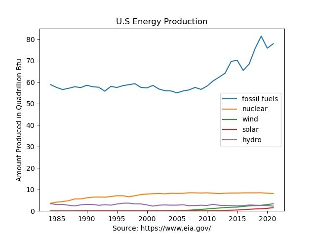
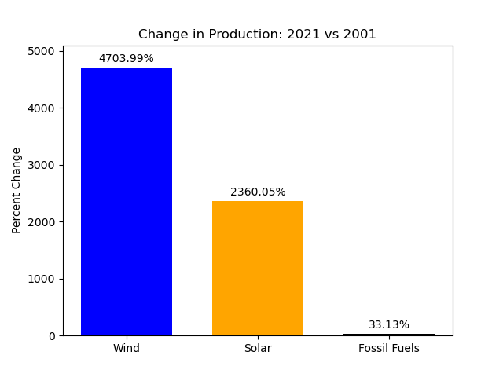

# us_energy_analysis
Analysis using data from eia.gov of energy production in the United States

# Analysis of US Energy Production by Source
Data was gathered from eia.gov and then cleaned and visualized in python. 
The data was imported from CSV located in this repo. Data compared is annual totals. Solar and Wind Data is not available prior to 1984 to data was dropped before 1984 to compare all source types.

